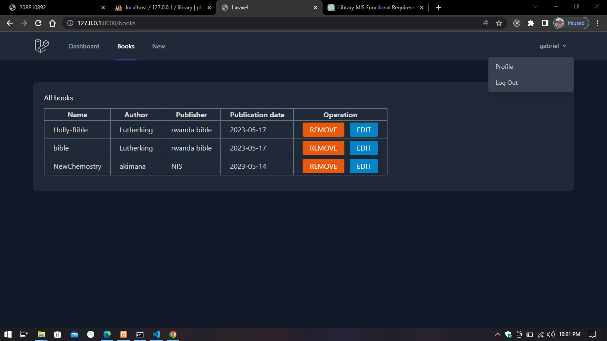

## REGISTRATION NUMBER
<h1>20RP00932</h1>

# NAMES
<h1>AKIMANA GABRIEL</h1>

## Functional requirements

User registration and authentication: The system should allow users to register for library services and authenticate their identities to access the system.

Catalog management: The MIS should provide functionality to manage the library's collection, including adding, updating, and deleting books or other materials. It should support features like categorization, tagging, and searching for items in the catalog.

### Database

<ul>
<li>DB_CONNECTION=mysql</li>
<li>DB_HOST=127.0.0.1</li>
<li>DB_PORT=3306</li>
<li>DB_DATABASE=library</li>
<li>DB_USERNAME=root</li>
<li>DB_PASSWORD=</li>
</ul>

### credentials
username: admin@library
 
password: 12345678

